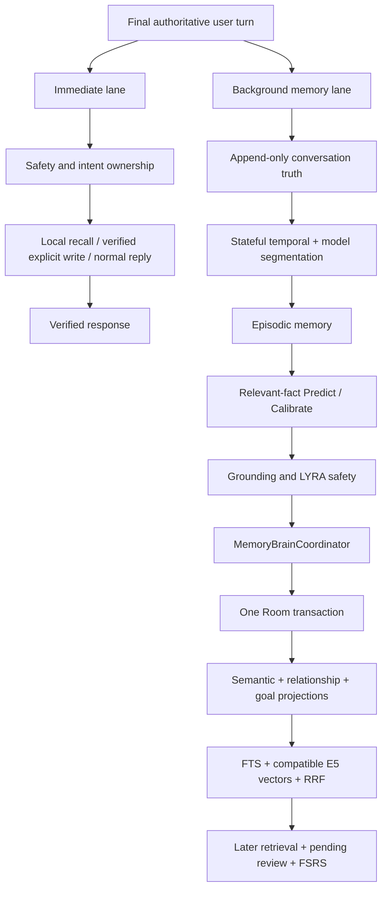

# LYRA AIRI/Plast-Mem memory runtime

The immediate lane never waits for segmentation, Predict/Calibrate, neural
model download, reindexing, or episodic review. Clear structured recall is
read-only and local. The background lane uses Room episode, pending-review,
and durable work-token state as its recovery truth. Local coroutines and
WorkManager are wake sources only: both enter the same atomic Room claim before
Predict/Calibrate. WorkManager wakes the coordinator and never writes memory
directly.

Embedding metadata is captured atomically with every vector. A warm-up hash
result cannot be relabelled as E5 if readiness changes after the operation, and
reindex work waits for a real E5 snapshot. Relationship and goal cards are
structured projections of canonical semantic facts, with the same lifecycle
and provenance available to general semantic retrieval.

The source-owned Context Registry and Task Memory contribute bounded current
state to LYRA Core. Spark Notify supplies proactive events and may produce no
response, a verified text reaction, or a Spark Command. Spark Command routes
structured work to existing phone/browser/screen/search/memory lanes but cannot
bypass memory authorization or Room ownership.

Relationship UPDATE/INVALIDATE resolves the structured projection through the
canonical semantic target's stable entity ID. Closing a relationship or goal
projection is verified inside the same Room transaction as canonical semantic
invalidation; a missing or mismatched projection aborts the transaction.
Relationship strength is a semantic model result with an independent
`semantic_relationship` field grounded to finalized USER spans. Android
cross-checks the requested operation against that verified meaning: inflation
fails closed and a weaker requested enum cannot erase a clearly stronger
interpretation. No production relationship-language vocabulary parser remains.
REINFORCE and INVALIDATE use the canonical target fact and stable entity and do
not require a restated relationship enum. NEW and UPDATE have one relationship
strength authority: source-grounded `semantic_relationship`; duplicate operation
enums are ignored and cannot serve as self-verification.

Durable retry time remains in `airi_background_work`. WorkManager uses one
APPEND_OR_REPLACE wake chain, so a delayed retry requested by an in-flight
worker survives that worker's completion. RUNNING is a bounded Room lease:
fresh claims cannot be stolen, expired claims return atomically to PENDING, and
the WorkManager drain awaits consolidation, review, or reindex execution in the
sole coordinator before completing its token. The owner schedules the earliest
PENDING eligibility or RUNNING lease expiry without polling or user input.
Goal rows are transactionally maintained structured indexes of the canonical
semantic GOAL lifecycle. Each projection records its current semantic memory
ID; NEW/UPDATE refresh that link, REINFORCE adds episode provenance without a
duplicate goal, and INVALIDATE closes the projection while retaining semantic
history. Structured payload literals are extracted per field so adjacent model
fields cannot manufacture cross-field grounding requirements.
