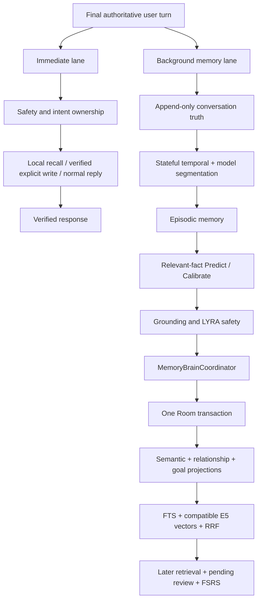

# LYRA AIRI/Plast-Mem memory runtime

The immediate lane never waits for segmentation, Predict/Calibrate, neural
model download, reindexing, or episodic review. Clear structured recall is
read-only and local. The background lane uses Room episode and pending-review
state as its durable queue truth; bounded coroutine channels only accelerate
execution.

The source-owned Context Registry and Task Memory contribute bounded current
state to LYRA Core. Spark Notify supplies proactive events and may produce no
response, a verified text reaction, or a Spark Command. Spark Command routes
structured work to existing phone/browser/screen/search/memory lanes but cannot
bypass memory authorization or Room ownership.
